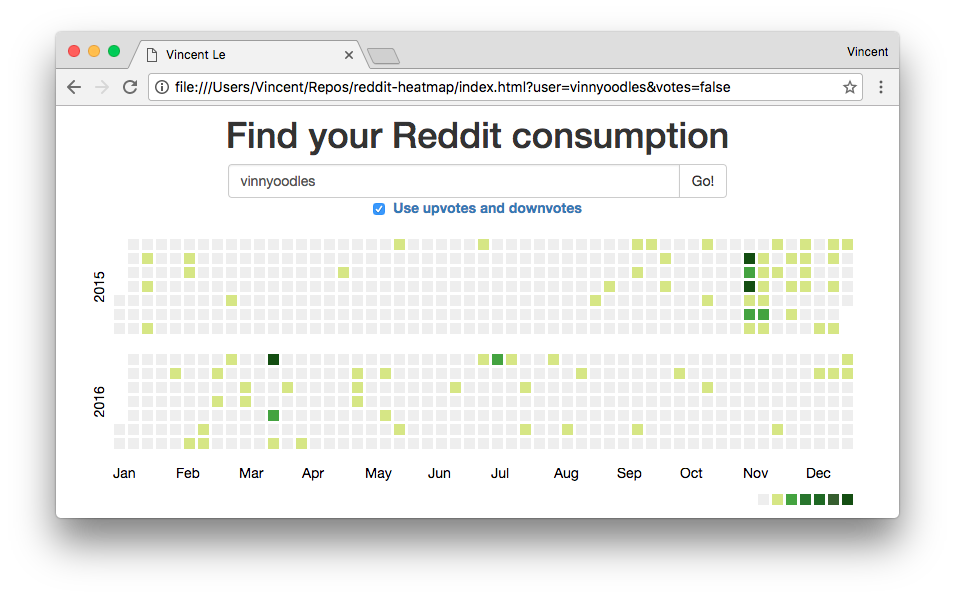

# reddit-heatmap

Inspired by Github's heatmap for keeping track of contribute. Now that 2016 is coming to an end, I thought this would be a nice way of checking how much time has been spent, or more realistically wasted :sob:, on Reddit.

### How it works
Thankfully, some of [Reddit's API endpoints](https://www.reddit.com/dev/api/#GET_user_{username}_{where}) are public so I didn't have to deal with the hassle of getting an API key or even worse getting an oauth token for each user.

For building the heatmap, this [example](http://bl.ocks.org/mbostock/4063318) was super helpful.

### Next steps
I'm planning on adding the specific day view similar to how GitHub shows the exact commit and PR details for a day when clicked. In this case, it'll show post and comment details.

### Built with
- [d3.js](https://d3js.org/) - Great tool for building graphics, seems like GitHub also used d3 for its heatmap.
- [jQuery](https://jquery.com/) - Yes, it is still super handy for DOM manipulation.
- [Bootstrap](http://getbootstrap.com/) - Great for the lazy developer that can't design properly.
